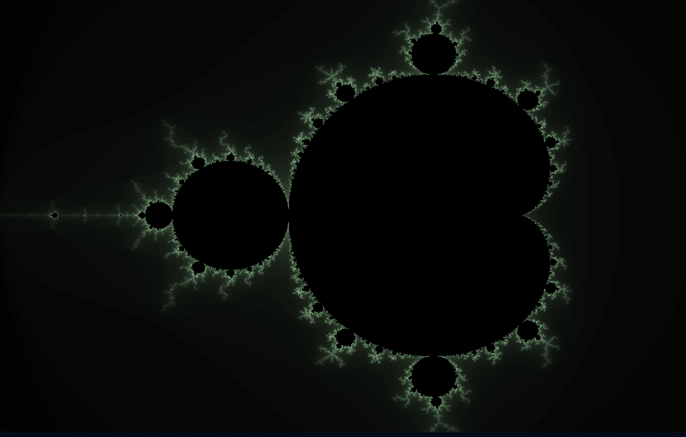
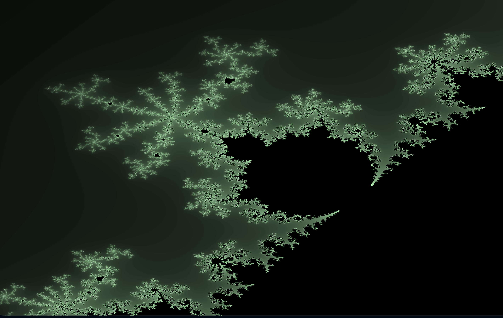

# Fractal

Welcome to Fractal visualization program! This software enables you to explore the mesmerizing world of the Mandelbrot Set, a complex mathematical fractal. With the added feature of mouse-controlled zoom, you can interactively select and magnify specific regions of the fractal, revealing intricate details and infinite complexity. Dive into the beauty of fractal geometry and unlock a visual journey that showcases the fascinating interplay of mathematics and art. Get ready to embark on a captivating voyage through the Mandelbrot Set, where every click brings you closer to discovering the hidden wonders of this mathematical marvel!

## Screenshot




## How to compile

Clone the repository:
```sh
git clone https://github.com/kisetil/fractal-hx.git
```
Make sure you have installed the complex library from haxelib
```sh
haxelib install complex
```
Compile the program with
```sh
openfl test html5   for the browser
openfl test hl      for hashlink
openfl test macos   for macOS
and so on ...
```

# To do
- Maintain 1:1 aspect ratio.
- Fix bugs...
  
